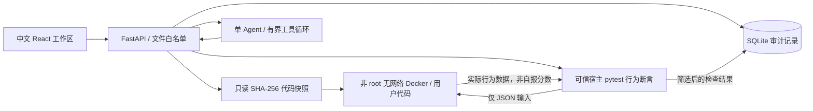

# 架构与边界

## 数据流

React + TypeScript + Monaco（本地打包，无 CDN）通过 Vite 同源代理调用 FastAPI。SQLite 的 `objects` 表按 kind 保存 task/session/event/run/hint/report；索引数据包含任务版本、会话工作区引用和代码快照引用。代码与测试在版本化目录中，工作副本和 SHA-256 快照分别在 `data/workspaces`、`data/snapshots`。

`runs.start` 在全局锁下保存快照并持久化 queued，后台线程改 running，创建独立服务端 pytest 进程。pytest **只运行可信行为断言**，不导入用户代码；它通过固定 Docker RPC 命令发送 JSON 输入。每个检查独立容器，只有当前快照只读挂载。容器中运行用户程序，返回 JSON 行为结果。宿主 pytest 比较固定输入对应的实际数据，不解析“PASS”文字、不信任容器自报分数。隐藏输入和断言不挂载到容器；被测代码必然能观察本次函数输入，这不等于隐藏测试源码暴露。

提交重新执行同一快照的全部公开和隐藏行为检查，保存提交时诊断与提示列表。报告绑定 run_id 和 snapshot。执行线程使用两个配额，会话内禁止重叠执行。服务重启先持久化取消标记并将 queued/running 标为 interrupted，阻止遗留 grader 启动下一项检查，再清理该运行容器；不声称恢复运行中的容器进程。已有完成报告保留。

## 执行限制

- 用户 65534、无网络、只读根文件系统、cap-drop ALL、no-new-privileges。
- 128 MiB 内存、0.5 CPU、32 PID、64 文件描述符；16 MiB 临时文件系统。
- 每检查 8 秒，整次 pytest 100 秒，输出上限 32 KiB；结束强制清理具名容器。
- 不挂 Docker socket、环境配置、模型密钥、其他工作区或隐藏文件。
- 文件 API 与 Agent 共用 manifest 权限白名单，拒绝绝对路径、未列出文件、路径穿越和符号链接；Docker 只接受可信清单中的精确文件集合。基础任务默认只有 `solution.py`。API 不接收 shell。
- 任务 B/C 通过 AST 比较锁定函数外代码，允许多种函数内部行为修复；A 通过重排/过滤行为断言拒绝关掉重排。公开测试永远来自任务包，不能保存到用户工作区。
- API 拒绝非本地 Host 与跨站 Origin；不设置宽松 CORS。Vite 只为本地开发使用。

## Agent

单 Agent，mock 明示确定性模式；real 为真实 HTTP 模型适配。每轮最多 4 次模型请求、6 次工具调用、相同参数重复操作最多一次，聊天模型输出每次 4096 token（含供应商推理用量）；180 秒后不再发起工具/模型操作，单次 HTTP 超时 60 秒。最后一轮禁用工具，要求模型仅根据已返回证据总结，不以固定预算提示替代正常回复。HTTP 超时为连接/读写阶段超时，不是严格的端到端墙钟计时。工具结果截断，工具失败持久化为可见错误。Pydantic extra=forbid，路径与运行 ID 严格校验；get_run_result 限当前会话。

工具限题面、允许文件、diff、公开运行、可见结果、会话证据与提示。提示只有用户点击服务端入口才递增；达到 L3 后原子拒绝追加，前端显示已获取全部提示；模型自行调用 request_hint 会被拒绝。模型不能写文件，代码块/函数定义/补丁格式输出会被拦截；重复工具参数按 JSON 规范化比较。系统指令要求区分事实/推测/待验证，不给完整补丁，不虚构通过或评价未展示的思考。审计只保存用户可见说明和工具结果摘要，不请求、存储隐藏思维链。

报告单独构造输入，只读取提交快照、提交时诊断/提示与对应检查。每条检查保留状态与简要覆盖，不包含聊天历史、工具日志或提示正文；diff/诊断按字符限额截断并标记遗漏。首次 1200 token；仅 output_limit 重试一次，进一步缩短输入、上限 1800 token。官方 DeepSeek v4 报告请求使用文档支持的 thinking.type=disabled，不把该字段发送给未知供应商。报告最多两次模型调用，每次等待 40 秒、整体预算 90 秒；超时后不再等待，迟到响应不能回写报告。底层在途 HTTP 请求可能稍后结束，不能承诺供应商立刻取消或不计费。尝试记录保存请求模型/预算、输入字符数与哈希、供应商 usage、结束原因、解析与空正文状态；未知字段不推算。

工具结果在只读解释层增加检查类别、可支持结论和未知覆盖边界。RAG 公开样例直接从版本化公开数据计算候选数、选中索引、重排/子集/空集与子集形状；隐藏检查不打开私有测试文件，仅返回状态与覆盖未知。范围通过不证明发生修改或功能正确；失败样例不能排除未测行为；两个正确备选实现等价不代表故障版与修复版等价。原始运行和历史报告不迁移或改写。

前端工具 JSON 默认折叠，摘要显示工具名称、状态与简要结果。react-markdown 渲染正文，不启用原始 HTML，禁止远程图片与外部/脚本链接；证据只连接已知运行/事件锚点，详情保留完整 ID。报告内已知短检查引用只能映射到本报告 run_id 下，不猜测其他执行。Markdown 文本节点转换短证据标签，不用字符串替换破坏已有链接或代码。

## 任务包格式

```
tasks/<id>/1.0.0/
  manifest.json           # ID、版本、中文题面、能力、时长、环境、允许文件
  initial/solution.py     # 故障代码
  public_cases.json       # 公开固定输入、期望、行为分类
  public_test.py          # 公开 pytest 契约；execute fixture 必须为 Docker RPC
  private/
    hidden_cases.json     # 服务端隐藏固定行为检查
    reference.py          # 参考修复
    normal.py             # 正常验收基线
    hints.json            # 三级提示，服务端逐次开放
    rubric.json           # 评价项目，不输出精确总分
```

任务 A 的固定 order 模拟检索后的确定性重排/过滤，选中 text 充当固定生成所使用的内容，不涉及模型随机输出。任务 B 的 LocalTool 为本地可控故障模拟，覆盖响应丢失前后与次数耗尽。任务 C 通过真实文件中的追加副作用日志检查重复；仅覆盖完成状态已持久化后中断，同一场景中的多次恢复共用磁盘目录。

## V0.1.1 多文件兼容实现

权限集中在 `workspace.permissions`，每次按会话固定任务 ID/版本读取 manifest。`readable = editable ∪ runtime` 且后二者不相交，只支持扁平 Python 文件名。文件接口、Agent 文件列表/读取、前端文件树使用同一规则。服务端 `private_assets` 不进入公开任务索引，私有文件不属于读取或挂载集合。没有改变旧三题版本文件。

新任务保存完整五文件集合，先准备新修订目录，再由 SQLite 单次更新工作区指针，验证失败不改变当前文件。只读入口从固定任务版本读取，保存接口拒绝提交它。旧单文件保存接口继续兼容。业务模块始终在容器中加载，宿主只复制字节、生成 diff 和比较行为。

新快照 SHA-256 输入为任务 ID、版本、稳定排序的路径/内容 JSON，包含全部业务模块和只读入口。旧题仍用原先的单文件摘要算法，不迁移旧快照。读取/执行新快照时校验精确文件集合、符号链接和固定入口内容。快照与报告关联同一次运行；Agent diff 汇总所有可编辑文件，超过 16000 字符明确标记遗漏；报告仍使用原来的 3000/1400 字符上限及 omission 记录，预算、重试机制不变。

容器 worker 将唯一只读挂载 `/workspace` 追加到隔离 Python 模块搜索路径，标准库路径优先；不会添加宿主工作区、其他会话或私有评测目录。运行命令、容器用户、无网络、资源上限和清理机制保持不变。运行镜像需重新构建。

新任务每次 scenario 独立创建临时 SQLite；固定入口读取持久化表内容，与查询结果一起返回。可信宿主评测器比较静态期望的查询、引用、版本表和完整片段集合，用户自报的日志或 PASS 不参与判分。公开诊断轨迹另存带 source=user_code 的字段，显示“非通过证明”；隐藏检查不保存轨迹、不向聊天工具提供秘密输入。多文件报告仍不包含工具轨迹和聊天历史，避免放大输入预算。

完整格式和输入域见 [TASK_PACKAGES.md](docs/TASK_PACKAGES.md)。本版选择扁平六文件清单，而非通用仓库导入；完整修订目录保留在数据目录中，暂不自动垃圾回收，备份时应包含 SQLite 和工作区/快照。

## 已知限制

- 2026-09-14 已实际通过 18 项 Docker 验收和完整浏览器提交闭环；随后已对现有真实配置实测工具往返、报告持久化、刷新和提示上限，详情见验证记录。
- 本机所有者可以检查所有源码与数据库。隐藏测试只承诺正常应用路径隔离，不防本机所有者；容器也不是对内核漏洞的绝对防护。
- 固定用例行为判分用于训练，不是对主动作弊的形式化证明。尤其 Python 反射/猴子补丁无法仅靠 AST 约束穷尽封锁；不作为高风险招聘判决系统。
- 模型输出是概率性的，指令限制不是可靠的语义安全证明；本次只验证现有供应商的最小闭环，未进行跨供应商兼容、质量或引用准确率评估。提示权限和文件访问由程序强制执行。
- 单进程 SQLite + 内存配额；不支持多 worker / 多机器。服务进程崩溃可能遗留容器，重启后记录标为 interrupted 并按运行标签尝试清理，另提供标签清理脚本；容器资源限制仍有效。
- 不自动取消已发起的执行。模型反馈在客观报告保存后生成，状态按 generating → generated/failed 持久化，失败保留客观报告和脱敏错误类别；重启将未完成反馈标为 interrupted 失败。历史已完成报告的快照、诊断和提示不重写。
- 草稿保存在当前浏览器；清理浏览器存储会丢失未保存内容。SQLite 与代码需一起备份。




## V0.2 独立上下文生成

`generation.py` 是有界的程序调度器，不是多个自治 Agent。需求设计只读需求和平台范围；构建读固定契约与私有故障要求；评测只读公开契约、接口和运行限制，初次及修复均不读取实现；作者明确指出测试自身错误时可单独重做评测，保存理由和旧资产并标为审核指导（不再声称完全盲测），不得仅因参考实现失败改变期望；教学阶段在执行通过后读取契约、故障说明和筛选后的验证摘要。各阶段重新创建消息，输入、输出、哈希、模型元数据与失败均保存在 generation 记录和独立资产目录，不保存隐藏思维链。

状态为 draft → analyzing → awaiting_contract → building → evaluating → validating → teaching → awaiting_review → published；失败、中断、取消独立持久化。全局一次生成，单阶段最多三次尝试、记录总计十次请求；取消不保证撤回已经计费的供应商请求。服务重启将活动阶段标为 interrupted，完成资产作为检查点，重试不会悄悄重复已完成调用。契约修订显式增加版本并归档旧资产，发布后只能另建版本。

生成评测只允许结构化 JSON 输入、期望值、覆盖映射和故障指纹。模型不能提供宿主执行的 pytest、shell 或自选镜像。宿主可信解释器比较容器输出，加载错误、协议错误、超时不能算故障命中。正常和参考必须全部通过，故障版必须稳定命中独立故障指纹且保留正常行为，每个规避实现必须被目标检查拒绝并保留正常回归。模型提出的检查仍须作者核对，不能据此声称全面正确。

生成任务沿用受限 Docker 参数；验证冻结当前平台镜像的本地 sha256 ID，后续训练指定该 ID 且禁止自动拉取。镜像缺失时失败，不静默换环境。业务模块只进入容器，宿主仅做语法与协议校验。普通进度 API 隐去私有输入和结果，作者 API 显式提供私有资产；训练 Agent 不调用作者 API。

发布在锁内核对审核摘要与资产摘要，以原子目录重命名冻结 `data/published/<task>/<version>`。manifest 接入已有权限、工作区、快照和报告，结构化检查走单独的 generated_json 判分分支，四道固定任务原有可信判分不变。历史会话按其任务版本读取 manifest。发布重复请求不重复创建实例，旧报告诊断、提示及代码快照不变。

前端使用 History API 的实际路由挂载；默认题库，训练和报告属于题库，作者审核属于生成。草稿使用独立 localStorage 键，服务端工作不依赖组件生命周期。

## roles-v1 生成协调器

`generation.py` 保留 API、冻结发布和旧策略；新任务委托 `generation_flow.py`。模型角色是各自独立 schema、上下文和资产提交权限的受限调用，不是自由聊天的自治进程。为兼容现有结构化资产协议，角色不另设工具调用内循环：允许读取的资产由协调器装入输入，候选 JSON 相当于唯一提交动作，执行只由程序发起。这使所有实际模型请求都进入同一账本，不产生隐含的工具轮次预算。

`generation_roles.py` 构造独立上下文。初次评测只见契约；诊断可见私有实现和行为证据，重复代码按哈希池去重。构建修复只见目标版本、公开行为观察和契约行为 ID；不转发诊断自由文字或隐藏输入。评测修复只见自身检查和受控修复枚举，任何源于实现审查的指导均标记非完全盲测。

`generation_diagnostics.py` 校验证据归属、目标版本、修复边界和原资产摘要。故障版预期失败且故障触发/正常回归门禁通过，不是应修的生成缺陷；程序拒绝此类误路由。规避若等价正确，应替换为真正错误候选，不能强迫测试拒绝正确实现。实现修复不能改评测；评测不能删旧检查、改输入/正确期望，追加覆盖、分类和故障指纹修改分别授权。正确期望歧义暂停作者确认。自然语言语义与覆盖完整性仍需作者审核。

协调器自动执行：候选 → Docker 矩阵 → 诊断 → 指定版本修复/受控评测修复 → 新矩阵。修复保留旧资产引用和矩阵，教学与审核摘要失效。重复修复格式失败重新诊断；格式、供应商暂时失败均受总预算控制，环境/鉴权/契约问题暂停。故障/规避判定仍由原可信结构化比较路径执行，Docker 权限和训练执行器不变。

`generation_budget.py` 原子预留请求/输出/输入字节，再按可靠 completion_tokens 结算；未知 usage 保留全额。每次调用最多100秒，矩阵最多240秒，均截断至剩余活动时间。等待作者期间不计时；中断期间未结算活动时间保守计入。另有200次协调操作上限。模型 HTTP 超时后迟到响应不能推进资产；重启 running 请求标 outcome_unknown，不自动再收费。

新批次由 SQLite 事务写入 child 与幂等回执；父记录及目录不改。expected_revision 拒绝旧表单。现有批次恢复复用完成检查点；并发全局槽与单任务令牌阻止重复协调器。若创建子批次时全局槽忙，子记录保持 interrupted，需显式恢复，不悄悄排队付费。取消允许账本和调用审计收尾，不允许迟到资产/状态覆盖取消。

发布仍需人工审批及原有完整摘要校验；没有把新的角色判断视为人工审核。固定四题、历史报告快照和已批准实例冻结算法保持不变。

## 契约局部修订与需求澄清

`contract_revision.py` 提供 Proposal/Patch/Check/Question、确定性路径/依据校验、版本归档与回答持久化。诊断的契约/期望歧义进入 `contract_review → contract_check → contract_apply`。契约角色不读实现、测试期望、实际输出、私有诊断自由文本或作者修复备注；只读原始需求、明确的用户回答、公开契约、平台约定和受控行为ID/问题类别。校核调用独立构造上下文，检查原文是否支持每个补丁及是否有必要向用户提问，费用计入现有共享预算。

补丁使用JSON Pointer，最多4条，校验契约hash、字段白名单、准确旧值、引用原文存在性、重复/父子路径冲突、单项与完整契约大小。禁止整包替换、删除补丁、替换整个行为/接口集合、修改文件权限与无关配置；平台默认只能支持约束/模拟说明，不能作为业务语义的依据。引用存在不等于语义蕴含，因此增加独立校核，模型不同意则返回契约角色重做，并保留两次输出审计。

自动修改仅作用于已确认但未发布的契约，保存 `contract_history` 中的完整旧契约/确认/资产引用/矩阵；新版本的confirmation.source为 `grounded_local_correction`，不伪称用户点击了新版本确认。补丁审核不等于发布审核。新契约沿用原需求授权，清空当前构建、检查、教学和矩阵引用，删除旧审核摘要后重新生成、验证；实际旧文件不删除。为避免模型把行为改变伪称文字调整，首版全部局部修订都重建重验。

需求歧义且独立校核同意时进入 `awaiting_requirement`，不先修改契约。POST requirement-answer 校验问题ID、当前修订号、完整答案集合；重复相同答案不重复计费，不同答案复用旧问题ID拒绝。答案按问题追加，原始需求不重写。草稿以job+question键保存，避免跨记录串写。新预算不能跳过未回答问题。

若核对结论为契约明确，保存 `contract_clarity` 并回到故障诊断；若原提案明确指出指定测试期望有误，仅给独立评测角色开放那些case的expected字段，继续禁止删检查、改输入/其他期望/实现。评测上下文只有契约、自身检查和字段权限，没有参考输出；修订仍必须过完整Docker矩阵和人工发布审核，不能由契约校核直接判通过。

新状态clarifying_contract/checking_contract支持中断恢复；已完成的补丁或校核调用可继续下个检查点，不重复付费；共享预算用尽仍停止。前端轮询遇到服务端契约版本变化会刷新编辑表单并撤销旧审核勾选，同版本轮询不覆盖用户编辑草稿。手动全量改契约或重新设计仍是显式操作，并清除过期自动补丁。

## 成本与作者审核展示，以及前五项回退

`generation_reliability.py` 现在仅包含供应商用量汇总和作者摘要，不参与协调器路由、执行缓存、预算或停止判断。作者摘要按已保存矩阵展示各版本的实际检查，继续隐藏于训练上下文之外。发布前重算摘要，前端在摘要改变时取消旧批准勾选。

撤回 reliability-v1 的自动档案、强制 evidence_sufficient 路由、停滞检测/结果复用、额外 evasion_witnesses 门禁及 impact_checks 六维契约校核。新任务不再写 reliability_version。旧标记及审计不改写；新批次不继承已撤回的控制状态，显式恢复旧 no_progress 记录从诊断阶段继续使用剩余预算。历史已完成的契约校核可读取旧 impact_checks 扩展，但它不再作为运行要求。

原角色协调器、预算和权限校验继续生效，原六项验证门禁（正常、参考、故障触发、故障回归、规避拒绝、无运行错误）不变。更早的局部契约补丁与独立校核保留。失败档案文件留在data中，自动归档/重放CLI及对应专用测试夹具移除；替换为回退兼容性测试，不删除私人证据。Docker边界、报告快照与历史冻结包不变。

## 分离故障证据与受限补丁（separated-evidence-v2）

`generation_protocol.py` 为新建角色生成记录提供版本化资产协议。JSON训练接口仍为agentlab-generated-json-v1，旧包、旧调用与旧矩阵不迁移。流程为构建→独立正确性评测→故障复现检查→Docker矩阵。独立评测只读公开契约；故障阶段只读冻结私有故障设计、公开契约和候选目标输入，不见代码、正确期望或执行结果。故障断言允许有界JSON路径与equals比较，无表达式、脚本或宿主导入。缺失路径不匹配，布尔和数字严格区分。引用原文只能验证来源，不证明语义；作者仍需核对断言是否表达预设症状。

独立评测每项保存classification_reason：target面向目标行为，regression须为故障版也保留的正常行为。所有正确版本必须通过所有检查。分类理由的结构校验不是自然语言正确性的证明；实际故障回归门禁和作者审核继续生效。

原六项门禁保留，新协议补充fingerprint_discriminates，确保正常和参考实际输出不命中故障断言。矩阵记录fingerprint_hash和私有fault_checks；审核摘要包含fingerprint资产，发布冻结保留作者材料。公共生成接口移除fault_checks，训练测试移除指纹与私有分类说明。变更评测使旧指纹资产归档，执行前重新生成；实际代码执行仍使用既有受限Docker边界。

评测修复请求使用EvaluationPatch而非整包重写，包含evaluation_hash、action、changes/additions；平台校验旧值、修改字段和既定修复范围，再合并为新资产。classification只改group及理由，expectation只改授权expected，add_coverage只追加。新协议fingerprint修复走独立故障阶段并保持未授权断言不变；旧协议faulty_expected修复仍兼容。实现修复继续只提供指定版本文件，不得修改评测。

诊断上下文明示每个门禁含义，并提供每个规避版本实际目标失败、回归通过和运行错误的证据ID，避免把汇总evasion_rejected=false解释成所有规避都不合格。契约明确且同hash的expectation路由直接进入有界评测核对，不重复契约调用；字段级补丁仍受权限、执行与人工审核约束。格式失败继续由原预算限制，不恢复已撤回的停滞检测、执行缓存或自动回归档案。

中断恢复对已完成资产执行确定性的收尾：归档失效指纹、清理已使用计划后转到下一阶段，不重复付费或把刚完成补丁当成no-op拒绝。模型响应与资产校验失败单独保存failure_kind，前端仅显示固定中文分类，不透出私有错误详情。


## 合并规范设计与构建（direct-build-v1）

新建API选择direct-build-v1，历史记录保持原流程。project_build在一个独立模型上下文内输出Bundle（公开规范、私有故障设计、正常/故障/参考/规避代码），不再调用design或等待用户确认技术契约。内部Contract作为可版本化的公开项目规范继续保留，供独立评测和冻结任务复现。

spec_review只收到原始需求、公开规范和输出字段清单，不接收代码、私有故障设计或运行实际输出。它为每个输出字段引用明确公开规则；规则缺失退回构建阶段局部补齐，目标歧义才awaiting_requirement。批准记录source=independent_specification_review、not_user_approval=true，不等同于人工发布批准。引用存在性校验不证明自然语言含义正确，最终作者审核仍必要。

补齐只能改指定字段，旧规范、资产、矩阵保留引用；新版本撤销旧审查、测试、指纹、教学和矩阵关联，再独立生成和执行。规范审查完成/Bundle完成后的中断可从已保存结果继续，避免重复付费。独立评测修复可返回patch、specification_issue或reject_plan，后两者保留旧测试，转规范审查或诊断，不以空补丁假装修复。诊断不能再次提交被拒绝的同资产同检查动作。

新流程仍受原全局预算、Docker隔离与发布门禁约束。审核摘要额外绑定project_build和spec_review资产；发布和训练不将作者私有资产加入学习者上下文。旧记录和已发布版本不迁移。

### 执行前评测纠错的最小补充

覆盖校验反馈缺失行为ID和现有case映射。失败候选另存rejected.json，不成为正式评测资产；仅原评测上下文读取候选，规范审查只接收覆盖/分组元数据，不接收隐藏输入、期望或项目代码。direct-build-v1在尚无执行矩阵时连续两次评测资产校验失败，会复用spec_review判断补测试或补规范；approve回到评测，revise仍使用已有局部字段权限与重新验证流程。不会新增自治角色、额外预算或自动降低门禁。候选引用随明确授权的新批次复制，中断仍使用原检查点。

direct-build-v1每条生成行为检查做两次独立Docker执行，记录repeat_count/repeat_actual/repeat_consistent；正常版和参考修复两次一致且满足期望才通过。重复时运行错误仍标error，不冒充行为故障。发布时把repeat_count=2写入冻结检查，训练评测沿用；旧已发布检查没有此字段，执行语义保持不变。每次仍受原隔离、8秒单调用及矩阵240秒/预算限制，总执行开销会增加。两次一致仅为有限样例证据，不是确定性形式证明。诊断能看到重复执行证据，不能在首次actual等于expected时忽略第二次结果。

## 角色合并 consolidated-v1

项目构建、评测、教学是三个逻辑角色，仍由同一适配器执行有界分阶段调用，无自治角色会话或共享隐藏记忆。generation_roles中的OWNERS/ROLE_INSTRUCTIONS统一阶段归属及共同职责，阶段提示约束本轮任务；attempt持久化role_id/role_policy/role与stage。新direct-build-v1任务启用，旧记录及显式重试保留自身策略，不迁移资产。

|角色|阶段|可见范围|
|---|---|---|
|项目构建|project_build|需求、公开规范、自己已有项目和指定补齐反馈；不看隐藏检查|
|项目构建|repair_build|已授权版本、冻结故障设计、相关公开执行证据、程序生成工单；不接收诊断私有原文或隐藏输入/期望|
|评测|spec_review|公开需求/规范、输出字段及覆盖元数据；不看代码/私有故障|
|评测|evaluation|公开规范及本阶段候选/授权补丁范围；不看实现或私有故障设计|
|评测|fingerprint|冻结故障设计及目标输入；不看实现、实际输出或正确期望|
|评测|diagnosis|当前实现、测试、冻结故障设计与最新矩阵；属于知晓实现的分析，不称盲测|
|教学|teaching|规范、私有故障说明、筛选验证摘要|

失败分析不再重复携带旧诊断和旧失败正文，以当前failed_gates和matrix为事实；旧记录仍保留审计。相同的重复执行输出不再次加入诊断，保留一致性字段；不一致时保留第二次输出。此处只减少上下文干扰和字节开销，不是自动判断自然语言语义正确。

构建工单由已校验结构字段生成矩阵/规范引用、精确目标及各版本保持条件。代码只允许修改指定版本，测试/指纹修改仍分开授权。自由文本change_request保留审计但不作为另一套执行指令。真正的故障保留与修复正确性仍由完整Docker矩阵判断，不能只凭模型声明或角色合并保证。没有新增发布许可或放宽门禁。

## 修复工单与候选接受（repair-handoff-v1）

新 API 任务及明确创建的新预算批次启用版本化协议；旧记录不迁移。诊断输出 `WorkOrder`，action 用 Pydantic 判别联合约束为 edit_code/reclassify/repair_fingerprint/review_spec/need_evidence。程序检查真实执行引用、公开行为原文、分类旧值、冻结故障引用与当前版本修改权限，再映射既有调度器；不再让模型同时填互相矛盾的 category/action/targets。语义正确性不能由这些结构校验证明。

构建修复只收到程序从当前矩阵导出的未完成义务/保留义务、公开行为规则、标记为推断的允许模块名、公开反例及原有冻结故障设计，不收到隐藏输入、隐藏期望或诊断自由文本。构建返回 modified/constraint_conflict/insufficient_evidence 三选一。冲突引用真实义务 ID；程序保存冲突双方及矩阵证据指纹。返回原代码同样成为交接问题，不算修复成功。下一轮诊断必须引用冲突 ID，并选择条件区分、分类问题、规范冲突或证据不足的处理分支。条件区分仍属待验证假设。

分类修改进入现有评测阶段独立复核（该修订受故障设计及诊断指导，不宣称完全盲测）；服务器仍仅允许 group/classification_reason 变化，输入与正确期望冻结。规范问题只将指定公开路径与已核对公开引用交给规范审查，不传递实现细节。缺证据而无法安全自动补充时保存建议验证并等待人工，不臆造实验结果。

代码/评测/指纹修复记录在 candidate_assets/candidate_history；工作集读取候选以完成执行，原 assets 和文件不覆盖。只有完整门禁通过且矩阵中的契约/代码/评测/指纹摘要与当前工作集一致，候选才晋升。旧资产保留修订引用；仍有候选时禁止发布。重启恢复可以读取候选，已完成的冲突返回恢复到诊断，不重放构建付费调用。

同证据同义务的冲突第二次出现、同阶段同错误再次拒绝、或再次执行得到相同失败行为（包含检查分类）时，保存 needs_manual_review；不同措辞或只改代码注释不算新的行为证据。不是证明任务不可解，只是停止当前无效自动循环。明确恢复须填写新依据；原预算及冲突审计不清零，所有调用仍受原预算上限约束。
