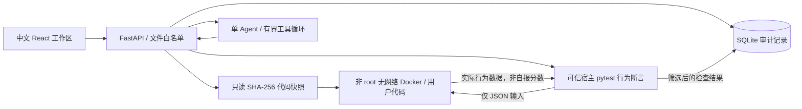

# 架构与边界

## 数据流

React + TypeScript + Monaco（本地打包，无 CDN）通过 Vite 同源代理调用 FastAPI。SQLite 的 `objects` 表按 kind 保存 task/session/event/run/hint/report；索引数据包含任务版本、会话工作区引用和代码快照引用。代码与测试在版本化目录中，工作副本和 SHA-256 快照分别在 `data/workspaces`、`data/snapshots`。

`runs.start` 在全局锁下保存快照并持久化 queued，后台线程改 running，创建独立服务端 pytest 进程。pytest **只运行可信行为断言**，不导入用户代码；它通过固定 Docker RPC 命令发送 JSON 输入。每个检查独立容器，只有当前快照只读挂载。容器中运行用户程序，返回 JSON 行为结果。宿主 pytest 比较固定输入对应的实际数据，不解析“PASS”文字、不信任容器自报分数。隐藏输入和断言不挂载到容器；被测代码必然能观察本次函数输入，这不等于隐藏测试源码暴露。

提交重新执行同一快照的全部公开和隐藏行为检查，保存提交时诊断与提示列表。报告绑定 run_id 和 snapshot。执行线程使用两个配额，会话内禁止重叠执行。服务重启先持久化取消标记并将 queued/running 标为 interrupted，阻止遗留 grader 启动下一项检查，再清理该运行容器；不声称恢复运行中的容器进程。已有完成报告保留。

## 执行限制

- 用户 65534、无网络、只读根文件系统、cap-drop ALL、no-new-privileges。
- 128 MiB 内存、0.5 CPU、32 PID、64 文件描述符；16 MiB 临时文件系统。
- 每检查 8 秒，整次 pytest 100 秒，输出上限 32 KiB；结束强制清理具名容器。
- 不挂 Docker socket、环境配置、模型密钥、其他工作区或隐藏文件。
- 文件 API 只接受精确名称 `solution.py`，拒绝符号链接；Docker 只接受仅含该文件的快照目录。API 不接收 shell。
- 任务 B/C 通过 AST 比较锁定函数外代码，允许多种函数内部行为修复；A 通过重排/过滤行为断言拒绝关掉重排。公开测试永远来自任务包，不能保存到用户工作区。
- API 拒绝非本地 Host 与跨站 Origin；不设置宽松 CORS。Vite 只为本地开发使用。

## Agent

单 Agent，mock 明示确定性模式；real 为真实 HTTP 模型适配。每轮最多 4 次模型请求、6 次工具调用、相同参数重复操作最多一次，聊天模型输出每次 4096 token（含供应商推理用量）；180 秒后不再发起工具/模型操作，单次 HTTP 超时 60 秒。最后一轮禁用工具，要求模型仅根据已返回证据总结，不以固定预算提示替代正常回复。HTTP 超时为连接/读写阶段超时，不是严格的端到端墙钟计时。工具结果截断，工具失败持久化为可见错误。Pydantic extra=forbid，路径与运行 ID 严格校验；get_run_result 限当前会话。

工具限题面、允许文件、diff、公开运行、可见结果、会话证据与提示。提示只有用户点击服务端入口才递增；达到 L3 后原子拒绝追加，前端显示已获取全部提示；模型自行调用 request_hint 会被拒绝。模型不能写文件，代码块/函数定义/补丁格式输出会被拦截；重复工具参数按 JSON 规范化比较。系统指令要求区分事实/推测/待验证，不给完整补丁，不虚构通过或评价未展示的思考。审计只保存用户可见说明和工具结果摘要，不请求、存储隐藏思维链。

报告单独构造输入，只读取提交快照、提交时诊断/提示与对应检查。每条检查保留状态与简要覆盖，不包含聊天历史、工具日志或提示正文；diff/诊断按字符限额截断并标记遗漏。首次 1200 token；仅 output_limit 重试一次，进一步缩短输入、上限 1800 token。官方 DeepSeek v4 报告请求使用文档支持的 thinking.type=disabled，不把该字段发送给未知供应商。报告最多两次模型调用，每次等待 40 秒、整体预算 90 秒；超时后不再等待，迟到响应不能回写报告。底层在途 HTTP 请求可能稍后结束，不能承诺供应商立刻取消或不计费。尝试记录保存请求模型/预算、输入字符数与哈希、供应商 usage、结束原因、解析与空正文状态；未知字段不推算。

工具结果在只读解释层增加检查类别、可支持结论和未知覆盖边界。RAG 公开样例直接从版本化公开数据计算候选数、选中索引、重排/子集/空集与子集形状；隐藏检查不打开私有测试文件，仅返回状态与覆盖未知。范围通过不证明发生修改或功能正确；失败样例不能排除未测行为；两个正确备选实现等价不代表故障版与修复版等价。原始运行和历史报告不迁移或改写。

前端工具 JSON 默认折叠，摘要显示工具名称、状态与简要结果。react-markdown 渲染正文，不启用原始 HTML，禁止远程图片与外部/脚本链接；证据只连接已知运行/事件锚点，详情保留完整 ID。报告内已知短检查引用只能映射到本报告 run_id 下，不猜测其他执行。Markdown 文本节点转换短证据标签，不用字符串替换破坏已有链接或代码。

## 任务包格式

```
tasks/<id>/1.0.0/
  manifest.json           # ID、版本、中文题面、能力、时长、环境、允许文件
  initial/solution.py     # 故障代码
  public_cases.json       # 公开固定输入、期望、行为分类
  public_test.py          # 公开 pytest 契约；execute fixture 必须为 Docker RPC
  private/
    hidden_cases.json     # 服务端隐藏固定行为检查
    reference.py          # 参考修复
    normal.py             # 正常验收基线
    hints.json            # 三级提示，服务端逐次开放
    rubric.json           # 评价项目，不输出精确总分
```

任务 A 的固定 order 模拟检索后的确定性重排/过滤，选中 text 充当固定生成所使用的内容，不涉及模型随机输出。任务 B 的 LocalTool 为本地可控故障模拟，覆盖响应丢失前后与次数耗尽。任务 C 通过真实文件中的追加副作用日志检查重复；仅覆盖完成状态已持久化后中断，同一场景中的多次恢复共用磁盘目录。

## 已知限制

- 2026-09-14 已实际通过 18 项 Docker 验收和完整浏览器提交闭环；随后已对现有真实配置实测工具往返、报告持久化、刷新和提示上限，详情见验证记录。
- 本机所有者可以检查所有源码与数据库。隐藏测试只承诺正常应用路径隔离，不防本机所有者；容器也不是对内核漏洞的绝对防护。
- 固定用例行为判分用于训练，不是对主动作弊的形式化证明。尤其 Python 反射/猴子补丁无法仅靠 AST 约束穷尽封锁；不作为高风险招聘判决系统。
- 模型输出是概率性的，指令限制不是可靠的语义安全证明；本次只验证现有供应商的最小闭环，未进行跨供应商兼容、质量或引用准确率评估。提示权限和文件访问由程序强制执行。
- 单进程 SQLite + 内存配额；不支持多 worker / 多机器。服务进程崩溃可能遗留容器，重启后记录标为 interrupted 并按运行标签尝试清理，另提供标签清理脚本；容器资源限制仍有效。
- 不自动取消已发起的执行。模型反馈在客观报告保存后生成，状态按 generating → generated/failed 持久化，失败保留客观报告和脱敏错误类别；重启将未完成反馈标为 interrupted 失败。历史已完成报告的快照、诊断和提示不重写。
- 草稿保存在当前浏览器；清理浏览器存储会丢失未保存内容。SQLite 与代码需一起备份。


