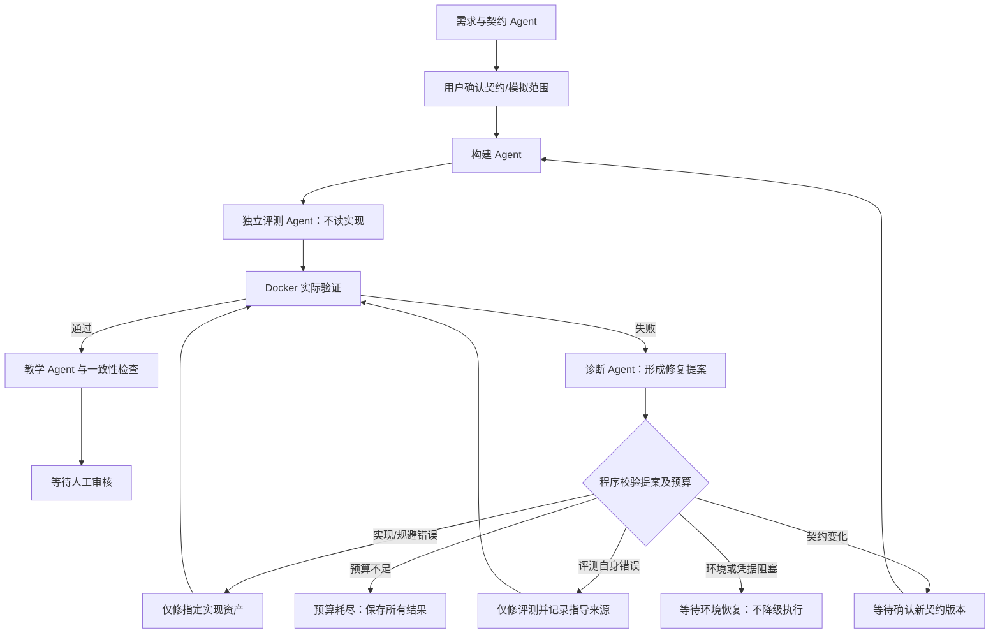

# 多 Agent 生成与失败自动修复实施方案

状态：实施规格与历史设计，2026-09-18。roles-v1 已落地；实际差异、执行验证和真实模型失败记录见 ARCHITECTURE.md 与 VERIFICATION.md。下文“建议/后续”保留原设计语境，不应当作验证结论。

## 1. 目标与不变边界

生成失败后不立即以 failed 结束：自动收集证据、诊断问题、选择正确修复阶段、保存新资产版本并重新验证，直到通过或本批预算耗尽。必须人工确认的契约变更、环境权限/密钥问题进入明确的等待状态；不能靠扩大权限、偷偷改契约或无限请求绕过阻塞。取消立即阻止后续阶段，已发出的请求可能仍计费。

保持现有四题、已发布实例、历史快照、报告、分级提示不变。不得重新生成已发布权限实例来代替修复生成系统。原失败实例保留；新尝试关联原记录。不改 Docker 隔离，不在宿主导入生成代码，不引入 CI 或个人仓库训练。多 Agent 仅用于题目生产，学习者训练仍为单 Agent。

## 2. 当前代码的具体问题

- backend/generation.py::work 捕获异常后直接置 failed；普通 retry 对完成矩阵的失败主要回到 build，不能可靠分辨评测问题。
- 每阶段3次、总请求10次及验证3次的计数保护了成本，但尚无跨角色诊断和按根因路由的自动循环。
- 构建返回 normal/faulty/reference/evasions 全量集合，修一个规避也会重写其他实现。
- repair_evaluation 已有作者明确指导路径，必须保留其审计和非完全盲测标记。
- 自动通过并不证明契约、测试期望与错误方案都合理；两次实际失败已证明这一点。

## 3. 角色与权限

不用角色互相自由聊天。采用多个具有独立上下文、固定输入输出 schema 和专属工具权限的 Agent，由可信程序协调器调度。先复用当前模型适配器，可使用同一模型；角色数量不等于判断可靠，不以投票或自报置信度判分。不保存隐藏思维链。

| 角色 | 可以读取 | 可以提交 | 禁止 |
| --- | --- | --- | --- |
| 契约 Agent | 需求、固定环境、作者澄清 | 候选契约、歧义与不可支持理由 | 未确认就修改冻结契约 |
| 构建/修复 Agent | 固定契约、自己的代码、公开反例、过滤后的修复指令 | 指定版本/文件的新资产 | 读取隐藏测试，改测试或环境 |
| 独立评测 Agent | 公开契约、接口、输入域、运行限制 | JSON行为检查、覆盖映射 | 初次读取任何实现；提供宿主Python评测器 |
| 失败诊断 Agent | 冻结契约、实现、完整评测与执行矩阵、尝试摘要 | 分类、证据ID、修复提案、必须保持不变的资产 | 直接修改实现/测试、发布或降低门禁 |
| 教学 Agent | 契约、私有故障说明、通过的验证摘要 | 题面、三级提示和追问 | 把完整补丁、隐藏输入写入题面 |
| 程序协调器（不是模型） | 资产引用、预算、状态、提案 | 校验路由、启动受限执行、记账和状态转换 | 把模型“已修复”当执行通过 |

模型工具只提供允许的资产读取、提交候选资产和执行结果查询，不接受任意路径、shell、镜像或依赖安装。所有工具参数继续使用 Pydantic 校验。生产阶段私有资产不进入学习者 Agent 上下文。

## 4. 阶段流程与状态机



实现/评测/教学的格式错误同样进入诊断或确定性分类后自动回原角色修复。设计未得到可确认契约时，格式问题自动修复，需求歧义等待用户回答。教学失败只重做教学，不重复有效的付费构建。

建议新状态：diagnosing、repairing_build、repairing_evaluation、waiting_provider、waiting_environment、awaiting_contract、budget_exhausted；保留原状态与失败历史兼容。失败事件记录在 attempts，不因一次可修复失败就终止整个 job。

## 5. 错误分类与路由规则

| 问题与证据 | 处理与修改边界 |
| --- | --- |
| JSON解析、字段或文件协议错误 | 确定性归类到资产生产角色；带具体校验错误重新生成该资产，不运行无效代码 |
| 正常版/参考未通过 | 对照契约、期望和实际输出判断；不能仅凭参考失败就改期望，不能默认一定是实现错 |
| fault_trigger失败 | 检查合法输入是否真能触发、错误行为指纹是否合理、测试是否漏触发；分别送构建、评测或契约确认 |
| fault_regression失败 | 区分故障引入额外缺陷与评测错误分类；例如越权触发样例不能被误标成正常回归 |
| evasion_rejected失败 | 检查规避是否真错、是否可由合法输入触发、是否与正确实现等价、测试是否漏反例；等价正确实现不得被测试强行拒绝 |
| 生成代码异常/超时 | 看具体版本和执行证据，通常修实现；不能把异常计为目标故障；所有版本同时失败需先检查环境/协议 |
| Docker不可用、镜像缺失、权限不足 | 本机健康检查；等待环境恢复，不调用模型改业务代码，不自动安装引擎/提权/降级宿主执行 |
| 供应商429/暂时5xx | 有上限的退避，遵守返回的等待指示；请求尝试和等待仍受批次预算与截止时间控制 |
| 密钥失效、鉴权拒绝 | waiting_provider，提示配置问题，不反复发送同一凭据，不输出密钥 |
| 模型超时、输出截断 | 记录用量未知情况；缩减输入或按角色受控调整输出预算；取消旧请求的写入资格 |
| 契约含糊或冲突 | 提出具体版本差异，用户确认后作废受影响资产并重验；不静默扩大输入域或降低标准 |
| 诊断自身无证据、指令非法 | 不执行提案；把校验错误交回诊断角色，计入预算；不能凭高置信度通过 |

遇到同类失败两次，不立即停止整个任务，也不原样重发：自动升级为独立诊断，要求指出上轮未解决的具体原因；有预算时继续合法修复。若没有可授权的修复，应等待契约/环境输入，不能为用完预算空转。

## 6. 修复提案与上下文隔离

新增 RepairPlan schema：

```json
{
  "failure_ids": ["执行检查ID"],
  "category": "implementation|evaluation|evasion|contract|environment|provider|unknown",
  "target_role": "builder|evaluator|contract|none",
  "target_variants": ["faulty"],
  "target_files": ["documents.py"],
  "contract_behavior_ids": ["trusted_source_only"],
  "observed_facts": ["可核对的事实及证据ID"],
  "hypothesis": "仍待验证的解释",
  "change_request": "需要修正什么",
  "must_preserve_hashes": {"evaluation": "原评测摘要"},
  "acceptance_checks": ["修复后必须重新执行的检查"],
  "requires_contract_confirmation": false,
  "guidance_source": "public|implementation_informed|author"
}
```

程序验证每个证据ID属于该 job、契约版本、资产和矩阵；target必须在权限白名单。提案不包含可执行命令。将观察与假设分别记录，而非存储隐藏思维链。

诊断 Agent 能看到私有材料，不意味着构建 Agent 也能看到。传给构建的事实由程序从公开检查重建；模型自由文字可能夹带隐藏输入，不能直接转发诊断长文。只有隐藏反例时先传行为类别与契约约束，不传秘密数据或完整期望。

评测修复默认只接收公开契约冲突和自身schema错误；如果指导源自实现审查，无论是否传原始代码，都标记 implementation_informed/review_guided，不宣称完全盲测。复杂自然语言契约的正确性不能完全程序判定，有歧义进入作者确认。不得因正常/参考输出不同于期望就授权改期望。

修复采用“限定版本的完整文件映射”，而非任意文本补丁或重写整包：例如只替换 evasions，normal/faulty/reference 的哈希必须相同；只修实现时评测哈希必须相同。重算验证矩阵，教学材料和审核摘要失效；未改契约则不制造虚假的新契约版本。

## 7. 自动循环与停止条件

```python
while True:
    reload_persisted_state()
    if cancelled: return persist_cancelled()
    if success: return persist_awaiting_review()
    if requires_human_contract_or_environment: return persist_waiting_reason()
    action = deterministic_route_or_diagnostic_agent()
    validate_permissions_and_asset_preconditions(action)
    if not reserve_budget_atomically(action): return persist_budget_exhausted()
    persist_action_intent(action)
    result = execute_bounded_action(action)
    persist_result_and_actual_usage(result)
    if result.failed:
        append_failure_event(result)  # 回到循环，不直接 failed
    else:
        promote_candidate_by_hash_and_invalidate_dependents(result)
```

这段为流程示意，预算预留必须同时覆盖诊断本身；不能先免费调用诊断再记账。环境检查等非模型操作仍计入操作次数/时间限制。

只有以下情况离开自动修复循环：已通过进入审核、预算不足、用户取消、等待不可自动解决的契约/凭据/环境输入，或服务中断。模型暂时错误和普通验证失败不是终止条件。

中断恢复：持久化每步意图、输入摘要、结果和配额；重启标记interrupted。不能确定供应商是否已执行的调用标为 outcome_unknown，不能悄悄重发付费请求；用户点重新生成后按保守预算继续。迟到响应不能覆盖新修订。单 job 同时一个协调器，按钮重复点击用幂等键防重。

## 8. 统一预算（建议初始值，实施后再校准）

每个授权批次最多24次模型请求、累计输出预算96,000 token、累计提交输入600,000 UTF-8字节、墙钟20分钟、10轮验证矩阵。单次模型调用100秒、单矩阵240秒，均需受批次剩余时间截断。实际 Docker 每检查8秒及资源上限不变。

角色输出上限建议：契约4000、构建12000、评测6000、诊断3000、教学3000。工具循环每轮最多4次工具调用，所有模型请求统一记账；角色没有各自独立的无限钱包。实际供应商参数由当前适配器支持范围决定，不能猜测兼容性。

每次发请求前原子预留输出额度；有可靠usage则结算实际值，缺失或超时未知则保留本次完整预留并标记unknown，不伪造精确消耗。输入字节额度是确定性保护，不能冒称实际输入token；分别显示供应商上报input/output/reasoning用量（缺失未知）。不声称该额度等于精确人民币费用或供应商所有计费token上限。

阶段原来的固定3次失败上限由新策略中的角色预算与总预算取代：重复失败触发重新诊断和路由，而非总预算仍充足却直接结束。保留旧策略版本，旧记录不重算。剩余额度不足以完成下一次最小请求时即预算耗尽，无须把余额强行用到0。

## 9. “重新生成（消耗Token）”按钮的最终语义

- 正常运行中显示当前角色、自动修复第几轮、原因摘要、已用/剩余预算；按钮禁用，提供取消后续操作。
- 失败后若仍有预算，系统自动循环，通常不需要用户点按钮。
- interrupted：按钮明确表示继续现有批次检查点，显示剩余额度和不确定请求。
- budget_exhausted：点击展开新尝试设置，显示原失败摘要、修复依据和新预算；确认后创建有 parent_job/revision 的新授权批次，保留旧失败，不改写旧计数。不能仅凭按钮标签偷偷新增预算。
- waiting_environment/awaiting_contract：先展示具体阻塞与必要操作；未解决前不可用模型请求绕过。
- 作者可补充“修复依据”，持久化后只交给对应角色；这段聊天分析不会自动进入生成上下文。
- 已发布实例不显示原地重新生成；创建新版本后重新确认、生成、验证、审核。
- 前端名称统一为“重新生成（消耗Token）”。mock模式显著标注不调用真实供应商。无须暴露随机种子、内部提示词或角色参数。

实施后按钮调用 regenerate API，明确区分旧批次恢复和新预算授权；旧 retry API 保留兼容。

## 10. 文件、数据与API改动清单

| 文件/模块 | 具体改动 |
| --- | --- |
| backend/generation_schema.py | 新增FailureRecord、RepairPlan、CandidateRevision、BudgetPolicy、BudgetLedger；校验大小和枚举权限 |
| backend/generation.py | 保留兼容API门面；work由一次流水线改为受控协调循环；旧retry委托新恢复策略，按policy_version区分旧任务 |
| backend/generation_roles.py（新增） | 各角色系统提示、独立上下文构造、可调用工具清单；复用现有completion，不新建学习者Agent |
| backend/generation_diagnostics.py（新增） | 确定性错误分类、模型诊断校验、只读证据过滤、路由规则 |
| backend/generation_budget.py（新增） | 原子预留/结算、全角色请求账本、截止时间及未知用量 |
| backend/storage.py | generation新增policy_version、batch_id、parent_job、asset_revisions、failure_history、active_action和budget引用；用显式事务保护跨记录更新 |
| backend/app.py | GET失败摘要/预算；POST regenerate（expected_revision、idempotency_key、repair_note、可选新批次预算）；旧retry兼容、不静默增额度 |
| frontend/src/Generation.tsx | 新状态、修复轮次/原因、预算、补充依据、重新生成和新批次确认；详细JSON继续默认折叠 |
| tests/test_generation*.py | 角色权限、自动路由、预算、幂等、中断、旧数据兼容及真实Docker矩阵 |
| frontend/e2e/generation.spec.ts | 自动失败修复到审核、耗尽后停止、新批次确认、刷新恢复和禁止未验证发布 |
| docs/GENERATION_FORMAT.md等 | 协议新增修订/诊断/批次字段与信任边界；记录真实成功和失败 |

文件权限、工作区快照、现有报告预算和已发布训练执行路径不做无关改动。新的候选修订独立存储；当前已发布权限任务审核摘要必须保持原值。

## 11. 两个失败案例如何具体修复

### 工具副作用

1. 新建关联旧实例的修订批次，把旧记录和根因摘要作为诊断证据，不直接把本聊天作为指令历史灌入所有角色。
2. 构建只修faulty：合法的第二次 is_retry=true 输入必须真实重复写入，正常不同操作仍成立。不能改输入域来为旧错误解释找借口。
3. 评测单独补充不同operation_id但相同recipient的场景，正确期望为两条记录。该指导源于实现分析，记录review_guided；不改原有正确期望。
4. 保留按recipient去重的真实错误方案；替换与正确实现等价的假规避。
5. 重新完整验证，正常/参考全通过，faulty稳定重复且保留回归，所有错误方案有合法反例。失败自动进入下一轮，直到通过或授权预算耗尽。

### 工作流恢复

1. 保留有效正常版、faulty、参考及契约；重点检查被命名为规避的版本。
2. 不通过测试强行拒绝提取变量或提前跳过空循环这种等价实现。
3. 构建生成真正错误的恢复策略，并提出契约内反例主张，如恢复直接返回导致未完成步骤漏执行、不同计划共用完成状态导致隔离错误；仅作为候选，仍由执行证实。
4. 优先用已有独立检查验证；若需补覆盖，按公开契约和指导来源单独审计，不能仅因规避未失败就改期望。

原方案列出以上验证任务；实际实施建立关联子批次进行真实联调，不修改两条旧失败记录。所有实际尝试见 VERIFICATION.md。

## 12. 实施顺序与验收

1. 先实现数据schema、不可变资产修订和预算账本；兼容旧记录，验证摘要未变化。
2. 提取角色上下文与权限，再实现诊断和自动路由；不要先做“多个头像”式界面模拟。
3. 确定性故障注入验证整个自动循环，接入前端状态、按钮、新批次确认。
4. Docker跑角色输出的真实资产；最后在用户授权预算内做真实供应商实验，逐次记录成功、失败和成本。

必须验证：

- 一个实现失败后无需点击，自动诊断→仅改实现→重验成功；独立测试哈希不变。
- 测试错误只修测试；不得把参考失败当改期望的唯一依据；实现指导有标记。
- 等价正确实现不被强行判错；错误规避需有合法反例且实际失败。
- 连续重复失败升级诊断，预算仍有时不直接终止；耗尽后零额外请求。
- 诊断自身出错、模型429/超时、Docker不可用均走正确分支；未知用量不能伪造。
- 重复点击只启动一次；取消/重启/迟到响应不覆盖资产或重复付费；恢复状态可查询。
- 契约变更必须确认，旧快照/已发布摘要/报告保持不变；跨角色和学习者私有资产隔离。
- 浏览器实测运行中自动修复、预算耗尽、明确新增预算、再次成功、人工审核发布与训练。
- 原四题及既有Docker、提示、报告回归无退化。
- 真实至少复测上述两类根因；所有尝试都记录，不能用mock成功证明真实模型修复能力。

只有角色独立输入、真实自动路由、实际执行证据和预算停止都可观察，才算多 Agent 失败修复完成。增加角色名称或提示词本身不算完成。
